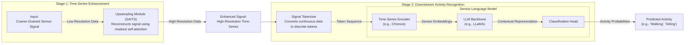

```mermaid
    graph LR
    %% === STAGE 1: Time-Series Enhancement ===
    subgraph Stage1["Stage 1: Time-Series Enhancement"]
        direction TB
        Input["Input:\nCoarse-Grained Sensor Signal"]
        SAITS["Upsampling Module (SAITS)\nReconstructs signal using masked self-attention"]
    end

    Enhanced["Enhanced Signal:\nHigh-Resolution Time-Series"]

    %% === STAGE 2: Downstream Activity Recognition ===
    subgraph Stage2["Stage 2: Downstream Activity Recognition"]
        direction TB
        Tokenizer["Signal Tokenizer\nConverts continuous data to discrete tokens"]
        subgraph SensorLLM["Sensor-Language Model"]
            direction TB
            Encoder["Time-Series Encoder\n(e.g., Chronos)"]
            LLM["LLM Backbone\n(e.g., LLaMA)"]
            Classifier["Classification Head"]
        end
    end

    Prediction["Predicted Activity\n(e.g., 'Walking', 'Sitting')"]

    %% === Connections ===
    Input -->|Low-Resolution Data| SAITS
    SAITS -->|High-Resolution Data| Enhanced
    Enhanced --> Tokenizer
    Tokenizer -->|Token Sequence| Encoder
    Encoder -->|Sensor Embeddings| LLM
    LLM -->|Contextual Representation| Classifier
    Classifier -->|Activity Probabilities| Prediction
```